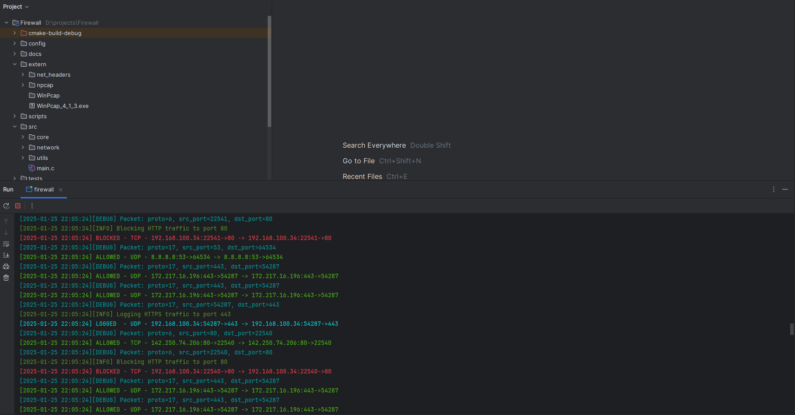
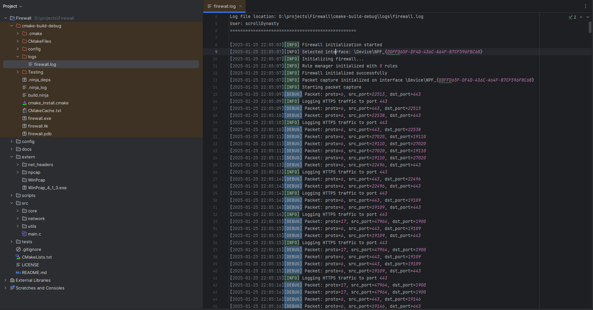

<div align="center">
  <h1>🛡️ Windows Packet Firewall</h1>

  <p>A modern, lightweight packet filtering firewall for Windows with real-time monitoring and logging capabilities.</p>

[](https://opensource.org/licenses/MIT)
[](https://www.microsoft.com/windows)
[](https://en.wikipedia.org/wiki/C11_(C_standard_revision))
[](https://cmake.org/)
</div>

## 📸 Application Screenshots

### Firewall Console Interface


### Detailed Log File View


## 🌟 Features

### 🔒 Packet Filtering
- HTTP traffic blocking (port 80)
- HTTPS traffic logging (port 443)
- Telnet blocking (port 23)
- FTP monitoring (ports 20, 21)
- ICMP traffic analysis

### 📊 Advanced Monitoring
- Live packet analysis
- Traffic statistics
- Protocol-based filtering
- Port-based rules

### 📝 Comprehensive Logging
- Event logging
- Traffic pattern analysis
- Security threat detection
- Performance metrics

## 🚀 Technologies

### Core Technologies
- **Language**: C17 (Modern C Standard)
- **System Integration**: WinAPI
- **Packet Capture**: Npcap

### Build Ecosystem
- **Build System**: CMake 3.15+
- **Toolchain**: Clion 2024.3.2

### Key Libraries
- **Packet Processing**: LibPcap
- **Network Operations**: WinSock2

## 📋 Prerequisites

- Windows 10/11
- Clion 2024.3.2
- CMake 3.15+
- Npcap library
- Administrator privileges

## ⚙️ Installation

### 1. Clone Repository
```bash
git clone https://github.com/scrollDynasty/windows-firewall.git
cd windows-firewall
```

### 2. Install Npcap
- Download from [Npcap Official Site](https://nmap.org/npcap/)
- Run installer with default settings

### 3. Build Project
```bash
mkdir build
cd build
cmake ..
cmake --build . --config Release
```

## 🎮 Usage

### 1. Run as Administrator
```bash
.\firewall.exe
```

### 2. Network Interface Selection
- Choose active network interface
- Begin real-time monitoring

### 3. Traffic Monitoring
- Watch live packet analysis
- Review logs at `./logs/firewall.log`

## 🛠️ Default Configuration

| Port/Protocol | Action      | Description                   |
|--------------|-------------|-------------------------------|
| HTTP (80)    | ⛔ Block    | Prevent unencrypted traffic   |
| HTTPS (443)  | 📝 Log      | Monitor secure web traffic    |
| Telnet (23)  | ⛔ Block    | Disable insecure remote access|
| FTP (20, 21) | 📝 Monitor  | Track file transfer activity  |
| ICMP         | ✅ Allow    | Permit network diagnostics    |

## 🔍 Project Structure
```
firewall/
├── src/       # Core firewall logic
│   ├── core/  # Main implementation
│   ├── network/  # Network handling
│   └── utils/    # Utility functions
├── include/   # Header definitions
├── extern/    # External dependencies
└── docs/      # Project documentation
```

## 🤝 Contributing
Contributions are welcome! Please read our [Contributing Guidelines](CONTRIBUTING.md).

## 📝 Version History
- **v1.0.0** (2025-01-25)
    - Initial release
    - Basic packet filtering
    - Logging system
    - Real-time monitoring

## 👤 Author
**scrollDynasty**
- GitHub: [@scrollDynasty](https://github.com/scrollDynasty)

## 📄 License
MIT License - see [LICENSE](LICENSE) for details.

## 🙏 Acknowledgments
- Npcap Development Team
- LibPcap Contributors
- Windows Network Programming Community

---

Made with ❤️ by scrollDynasty

© 2025 Windows Packet Firewall. All rights reserved.